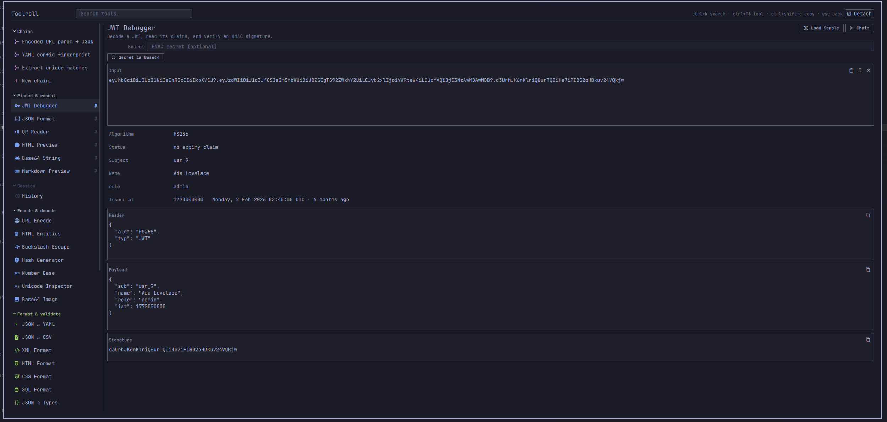
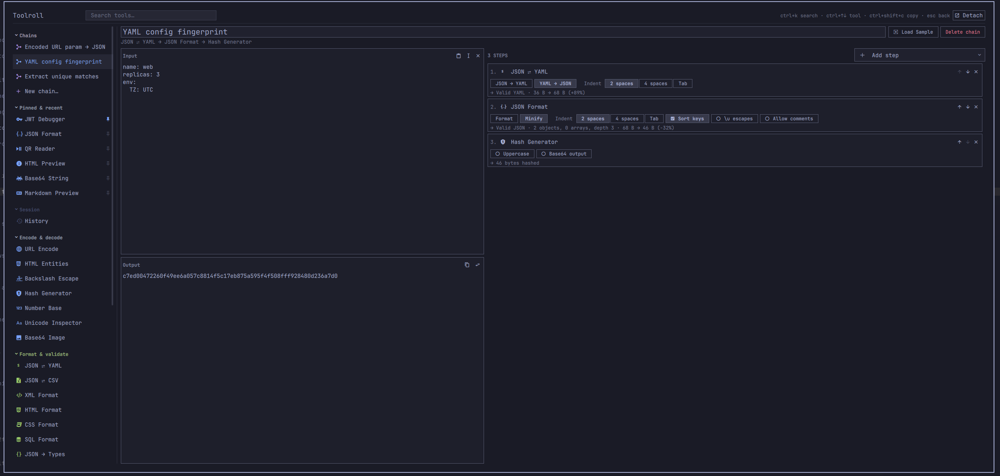

# Toolroll

Thirty-five offline developer tools for the Omarchy shell — the small
conversions that interrupt real work: decode this JWT, format that JSON, what
time is `1700000000`, what does this cron line actually do.

Everything runs inside the already-running `omarchy-shell` process. No network,
no telemetry, no second app to launch.

A tool roll is the canvas wrap you unroll, take one tool from, and roll away
again — which is what this is: it appears on a keystroke, does the one thing,
and gets out of your way. Unless you detach it, in which case it stays.



It opens on a key you choose — see [Install](#install).

**[Install](#install)** · **[Removal](#removal)** · **[The tools](#the-tools)** ·
**[Samples](#samples)** · **[Clipboard detection](#clipboard-detection)** ·
**[Chains](#chains)** · **[The sidebar](#the-sidebar)** ·
**[Keys](#keys)** · **[Security](#security)** ·
**[Layout](#layout)** · **[Tests](#tests)**

## Install

```bash
omarchy plugin add https://github.com/iainfreestone/omarchy-toolroll.git
omarchy plugin enable io.github.iainfreestone.toolroll
```

Plugins land disabled so you can read the code before running it. This one is
about 12,000 lines of QML and JavaScript and runs unsandboxed inside your
shell, so that pause is worth taking — start with `lib/catalog.js`, which is
every tool, and `Toolroll.qml`, which is everything that touches the outside
world.

Then bind it to a key. Omarchy plugins cannot register a shortcut themselves,
and which keys are free is your business rather than this README's, so pick one
and paste the command:

```lua
-- ~/.config/hypr/bindings.lua
o.bind("<your key>", "Toolroll", "omarchy-shell shell toggle io.github.iainfreestone.toolroll")
```

## Removal

```bash
omarchy plugin remove io.github.iainfreestone.toolroll
```

That asks for confirmation, then deletes the plugin folder. Two files are left
behind deliberately, because they are yours rather than the plugin's — your
saved chains, and your settings, recent tools and per-tool inputs:

```bash
rm ~/.config/omarchy/toolroll-chains.json
rm ~/.local/state/omarchy/toolroll.json
```

Delete the keybinding you added to `~/.config/hypr/bindings.lua` and nothing
remains.

Those two are the only files Toolroll ever writes to. It does not touch
`shell.json`, your Hyprland config, or any file it did not create itself —
nothing of yours is modified without you doing it. The only other things it
puts on disk are the QR images it renders, which go to `$XDG_RUNTIME_DIR` and
vanish with the session, and whatever you deliberately send to `~/Pictures` with
the **Save** button. It reads your theme's `colors.toml`, and never writes it.

## Requirements

Omarchy with the Quattro shell, and `wl-clipboard` — both already present on a
standard install. Two tools shell out to optional packages and say so in place
if they are missing:

| Package | Needed by |
|---|---|
| `qrencode` | QR Code (writing) |
| `zbar` | QR Reader (reading) |

```bash
omarchy pkg add qrencode zbar
```

Everything else — every parser, formatter, digest and generator — is plain
JavaScript with no dependencies at all.

## The tools

| Encode & decode | Format & validate | Text & data | Time & web | Generators |
|---|---|---|---|---|
| Base64 String | JSON Format | Case Converter | Unix Time | UUID & ULID |
| Base64 Image | JSON ⇄ YAML | Text Statistics | Cron Parser | Random String |
| URL Encode | JSON ⇄ CSV | Line Tools | URL Parser | Lorem Ipsum |
| HTML Entities | JSON → Types | Text Diff | Color Converter | ID Inspector |
| Backslash Escape | XML Format | RegExp Tester | QR Code | |
| JWT Debugger | HTML Format | Markdown Preview | QR Reader | |
| Hash Generator | CSS Format | HTML Preview | | |
| Number Base | SQL Format | | | |
| Unicode Inspector | | | | |

Plus **History**, which has its own Session section in the sidebar rather than
a place in the grid.

Notes on the ones with opinions:

- **Hash** does MD5, SHA-1/224/256/384/512 and CRC32 in pure JavaScript —
  no `openssl` dependency — and switches to HMAC as soon as you type a key.
  Every digest is verified against `openssl` in the test suite.
- **JWT** verifies HS256/384/512 signatures for real. RS/ES tokens are
  reported as unverifiable rather than shown with an unearned checkmark.
- **JSON** reports the line and column of a syntax error, and has a lenient
  mode for JSONC (comments, trailing commas, bare keys).
- **YAML** covers block and flow collections, block scalars, and multi-document
  streams, and follows the YAML 1.2 core schema — so `no` stays the string
  `"no"`. Anchors, aliases and custom tags are reported, never guessed at.
- **Number Base** converts on digit strings, so a 256-bit hex value converts
  exactly instead of collapsing into a float.
- **Random String** draws from `/dev/urandom` and says so; if that is
  unavailable it says *"Math.random fallback — not for secrets"* instead.
- **QR Code** shells out to `qrencode`. Install it with
  `omarchy pkg add qrencode` if the pane says it is missing. The preview has
  **Copy image** and **Save**, the same as a chain that ends in one.
- **Base64 Image** goes both ways between a picture and a `data:` URI, with
  `url(…)` wrapping for stylesheets. Neither direction decodes in JavaScript:
  encoding shells out to `base64(1)` and decoding hands the URI to Qt, whose
  image loader understands the scheme natively. The type is read from the
  payload's magic numbers, so a URI that claims `image/jpeg` over PNG bytes
  gets called out rather than believed.
- **JSON → Types** infers a shape from a sample and prints it as TypeScript,
  Go or Rust. It is honest about what a *sample* can tell you: a field missing
  from some array elements becomes optional, one that is sometimes null becomes
  nullable, and one that is a string here and a number there becomes the
  language's escape hatch rather than a guess. Go gets its initialisms right
  (`ID`, `APIURL`) and Rust escapes keywords (`r#ref`), because generated code
  that fails to compile or trips the linter on arrival is not much of a favour.
- **QR Reader** is the mirror of it, via `zbarimg` (`omarchy pkg add zbar`).
  Copy an image — a screenshot of a code on someone's slide will do — and open
  Toolroll: an image on the clipboard can only mean one thing, so it goes
  straight there and decodes. Several codes in one picture come back one per
  line.

## Samples

Every tool that takes typed input carries three of them, one press of the
**Load Sample** button apart — top right of the pane, next to **Chain**. The
hardest moment in a toolbox like this is the empty input pane: **Number Base** does not tell you whether it wants `0xFF` or `255`
or `11111111`, and **JSON → Types** gives no hint that the answer comes out as
TypeScript. A sample answers both halves at once — what goes in, and what
comes back.

Three rather than one, because a single sample reads as *the* input rather
than *an* input. Three show the shape of what a tool accepts: that Base64 goes
both ways, that **Color Converter** takes hex and `rgb()` and `hsl()`, that **Unicode
Inspector** is what to reach for when a string has something invisible in it.
Each arrives with its own options set, so a sample that needs Decode selected
gets Decode selected rather than opening with an error. Pressing again never
gives you back the one already on screen.

The three built-in chains have their own, written for the whole chain rather
than borrowed from step one — and the fingerprint chain's samples carry the
lesson in the pair: the same config, reordered and requoted, comes out with an
identical digest.

A chain you built yourself has no samples written for it, so it borrows its
first step's and keeps only the ones that survive all the way through, checked
by running them. A chain of base64-decode → JSON has no use for the sample
that shows base64 *encoding*; it would fail at step one and teach the chain by
breaking it. If none survive, the button hides rather than loading something
that does not work.

The button also hides where there is nothing to demonstrate: the three
generators ignore their input, History browses past sessions, and the two image
tools want a file rather than text.

Every sample is run by the test suite, which asserts each one succeeds and
returns something. A sample that quietly stopped working would be worse than
no sample at all.

## Clipboard detection

On open it reads the clipboard and picks the tool that fits. Copy a JWT and
press the shortcut — the JWT debugger is already showing its claims. Copy a
hex color, a cron line, an epoch, a URL, a CSV block, a base64 blob: same
thing. When several tools plausibly apply, they appear as chips under the
search field. When nothing is convincing, it leaves your selection alone.

It can read **what you have highlighted** instead of what you copied, which
removes the Ctrl+C step entirely — highlight a JWT anywhere on screen and press
the key:

```lua
-- ~/.config/hypr/bindings.lua
o.bind("<your key>", "Toolroll (selection)",
  "omarchy-shell shell toggle io.github.iainfreestone.toolroll '{\"source\":\"primary\"}'")
```

Every input pane also has a paste-the-selection button next to paste-from-
clipboard, and `"source": "primary"` works for headless runs too.

## Chains

A chain runs one tool's output into the next. A payload out of a link is
URL-decode → base64 → format, three layers deep; pulling the unique IDs out of
a log is extract → dedupe → sort. Doing that a tool at a time means bouncing
output back into input on every pass, and losing your place when it breaks.

You do not have to know chains exist to end up with one. Every tool has a
**Chain** button in its header that starts a chain with that tool as step one,
carrying your input and options across and opening the step picker so the next
move is visible. And the first time you push a tool's output back into its own
input — which is a chain built by hand — it mentions the button, once.

Chains appear at the top of the tool list. Each step shows its own options and
what it did — the useful question when a chain misbehaves is never "did it
fail" but *which step, and what did it see* — so a failed step is highlighted,
the steps after it are dimmed as never-reached, and the partial output is still
there to look at.

They live in `~/.config/omarchy/toolroll-chains.json`, which is plain, readable
JSON that only records options you actually changed. Edit it by hand, keep it
in your dotfiles, send one to a colleague; the shell picks up changes without a
restart.

Three starters ship with it, and all three are three steps deep on purpose —
if a single conversion is all you need, run the tool. A chain earns its name
where no single tool gets you from what you have to what you want:

| Starter | Steps | The job |
| --- | --- | --- |
| **Encoded URL param → JSON** | URL-decode → base64 → format | An OAuth `state` or `?data=` blob, unwrapped three layers to something readable |
| **YAML config fingerprint** | YAML→JSON → minify, sorted keys → SHA-256 | Are these two configs the same? Reformatting and key order can't hide from a digest |
| **Extract unique matches** | RegExp → dedupe → sort | Every match in a wall of log, repeats dropped, sorted — the thing everyone does by hand |



Above: the fingerprint chain on a small service config, each step showing its
own options and what it did with what it was handed.

A chain can also **end in an image**. `QR Code` as the last step renders the
picture in the output pane instead of echoing the text that went into it, with
**Copy image** and **Save** in the pane header — copy puts a real `image/png`
on the clipboard to paste straight into a chat, save drops it in `~/Pictures`.
Headlessly the same chain puts the PNG on the clipboard directly: copy a link,
press a key, paste a QR code.

An image step anywhere *but* last can only pass its input through, so instead
of doing nothing quietly it says so on the step card. The chain still runs —
being told what is wrong beats being refused.

### Running a chain without opening anything

```bash
omarchy-shell shell call io.github.iainfreestone.toolroll run '{"chain":"url-param-json"}'
```

That reads the clipboard, runs the chain, writes the result back, and posts a
notification — with no window at any point. Bound to a key, the whole
interaction is: copy, press, paste.

```lua
-- ~/.config/hypr/bindings.lua
o.bind("<your key>", "Decode URL param",
  "omarchy-shell shell call io.github.iainfreestone.toolroll run '{\"chain\":\"url-param-json\"}'")
```

Tools whose input is an image work headlessly too, reading the clipboard's
picture rather than its text — `{"tool":"qr-read"}` puts the code's contents on
your clipboard, `{"tool":"base64-image"}` puts a data URI there.

A single tool works the same way (`{"tool":"hash"}`), and `"quiet": true`
suppresses the notification for scripts. Whatever the chain produces — text or
an image — lands on the clipboard in the right form. On failure the clipboard
is left exactly as it was.

## The sidebar

Thirty-five tools do not fit in the window, so the list says so in two ways,
answering two different questions. The edges fade wherever there is more in
that direction — otherwise a list running past the bottom of the screen looks
exactly like a list that has ended. A slim bar on the right says how much more
there is and where you are in it, brightening while you scroll.

Groups fold. Click any heading to collapse it; the heading stays, with a count
of what is behind it, because once folded it is the only thing left to click.
Collapsed groups are skipped by the arrow keys rather than being a row that
selects nothing.

Groups also move. Hovering a heading reveals arrows that shift it up or down,
so the sections you use sit where you want them. **Chains** and **Pinned &
recent** stay put — they answer "what was I just doing", which is only a useful
question at the top — and a saved order that has never heard of a category
added in a later version leaves it where it naturally falls rather than dropping
it. Both the folds and the order are remembered.

Searching ignores all of it and shows the plain ranked list: an arrangement you
chose for browsing would only fight the ranking that is the point of searching.

## Pinned & recent

The five tools you have most recently *run something through* sit at the top of
the list, and any of them can be **pinned** so that it stops moving. Every row
in that block carries a pin, faint until it is pinned or under the cursor.

It appears there and nowhere else. Pinning promotes a tool to the top of that
block, so the action only means anything for a tool already in it; a tool gets
there by being used. `Ctrl+P` pins whatever is selected, wherever it is.

Pinning exists because Recent alone churns, and not all of that churn is yours:
clipboard detection seeds an input and runs it, so a tool you never chose can
take one of the five slots. A pinned tool sorts first, in the order you pinned
them, and never ages out — and the cap applies only to the unpinned half, so
pinning never costs you a recent slot. The heading says "Recent" until
something is pinned, then "Pinned & recent".

They share one block rather than getting a section each: a second heading above
the tools would be more chrome for the same job. Chains are not pinnable
because they already sit at the top permanently. It keys off use rather than
selection, so arrowing down the list — which does select each tool on the way past — doesn't
fill it with things you only skimmed. Recent tools are hoisted out of their
categories rather than duplicated, so every tool has exactly one row and
arrow-key navigation stays unambiguous. Searching shows the plain ranked list.

## History

Every run lands in **Session → History**, newest first, with the tool, how long
ago, and a one-line preview. Click one to go back exactly where you were —
same tool, same input, same options.

It is **in memory only**, and that is deliberate: this is a tool you paste
JWTs, tokens and API keys into, and a durable record of every input would be a
liability nothing else here justifies. The per-tool sessions already survive a
restart for the one thing you were last working on. Secrets are stripped before
an entry is built, using the same declaration the session store uses, and
there is a Clear button.

Runs are recorded on a debounce, so consecutive edits to the same text collapse
into one entry rather than leaving one per keystroke.

## Undo, and what it covers

Typing already has its own undo — `Ctrl+Z` in any input pane, courtesy of the
text widget. What that cannot reach is the handful of operations that replace
the input *wholesale*, because assigning text in bulk wipes the widget's undo
history along with it: Clear, Load Sample, Paste over what was there,
Send output back to the input, and clipboard detection landing on top of work
you were mid-way through. Removing a chain step is the same shape — it takes
the step's options with it and asks nothing first.

So an **Undo** button appears in the header for twelve seconds after any of
those, saying what it will put back. `Alt+Z` does the same thing. (Not
`Ctrl+Shift+Z`: that is redo in every Qt text editor, so the focused field
swallowed it before the shortcut ever saw it.)

It is one slot, not a stack — this is a way back from six specific moments,
not a general history.

## Errors point at themselves

When a parser knows where it went wrong — JSON knows the exact character, YAML
knows the line — the error is not just a sentence with a number in it. It reads
in the theme's urgent colour, and clicking it (or `Ctrl+E`) puts the cursor on
the offending character and scrolls it into view, however far into the document
it is.

## It takes its colours from your theme

The sidebar's section headings and icons are tinted from the **theme's own
palette** — Omarchy themes declare `red`, `green`, `yellow`, `blue`, `cyan`,
`magenta` and usually `orange` in `colors.toml`, and all twenty-two stock
themes do. Nothing here invents a colour, so nothing can clash with the theme
it sits in; a theme that omits a hue falls back to the accent.

That palette is read directly, because the shell's `Color` singleton parses
`colors.toml` and keeps only five roles — foreground, background, accent,
muted, and urgent — discarding the rest.

It buys two things beyond decoration: sections become scannable at a glance
across thirty-five tools, and a diff can use green for an addition and red for
a removal — near-universal convention, and otherwise only reachable by
hard-coding two colours that would fight half the themes.

## Two shapes

By default it is a **summoned overlay**: scrim, exclusive keyboard focus,
convert one thing and get out. That is the right shape for the clipboard-
detect-and-go flow, and it matches the shell's other overlays.

**Detach** in the header turns it into an ordinary window — Hyprland tiles it,
moves it, resizes it and sends it to another workspace like anything else, with
no scrim and nothing stolen from the window underneath. That is the right shape
for a longer session: building a chain, working through a big document, keeping
it open beside your editor. Both have first-party precedent: the clipboard and
emoji overlays are the former, `omarchy.dev-gallery` is the latter.

The UI itself exists once and is re-parented between the two surfaces, so
detaching preserves everything — input, options, scroll position, focus.

The overlay is a layer-shell surface rather than a window, which is worth
knowing because it means your window-management keys do not apply to it:
`SUPER+W` and friends find no active window and do nothing, exactly as they do
over the clipboard and emoji overlays. `Escape` is how it goes away. A detached
window is an ordinary toplevel and closes like any other. The choice is remembered between sessions, and is also
reachable over IPC if you would rather bind it:

```bash
omarchy-shell shell call io.github.iainfreestone.toolroll setDetached true
```

If you would rather it floated than tiled:

```lua
-- ~/.config/hypr/windows.lua
o.window({ class = "org.quickshell", title = "Toolroll" }, { float = true })
```

## Keys

| | |
|---|---|
| `Ctrl+K` | jump to the tool search |
| `↑` `↓` in search | change tool |
| `Enter` / `Tab` in search | move into the tool |
| `Ctrl+↑` `Ctrl+↓` | change tool or chain from anywhere |
| `Ctrl+E` | jump the cursor to a positioned error |
| `Ctrl+P` | pin or unpin the selected tool |
| `Alt+Z` | undo a bulk replacement (Clear, Load Sample, paste-over…) |
| `Ctrl+Shift+C` | copy the output |
| `Ctrl+Shift+V` | paste into the input |
| `Ctrl+Enter` | run / re-run / regenerate |
| `Esc` | back to search, then close the overlay |
| `SUPER+W` | closes a **detached** window; does nothing to the overlay, which is not a window |

Clicking any row of a report copies that value.

## Large inputs

Everything here runs inside `omarchy-shell`, which also hosts the bar, the
notification daemon and the polkit agent. A multi-megabyte paste that ran on
the UI thread wouldn't just stall this overlay — it would stall the desktop.

So work is placed by size:

| Input | Where it runs |
|---|---|
| under 32 KB | inline — the thread hop costs more than the work does, and typing must feel immediate |
| 32 KB – 2 MB | a `WorkerScript` thread, with the debounce stretched from 80 ms to 300 ms |
| over 2 MB | the worker, but only when you ask (`Ctrl+Enter` or the Run button) — re-parsing megabytes per keystroke would queue work faster than it drains |

Measured on a 5.6 MB document: 10.8 s of frozen desktop if that work runs
inline, against ~2.5 s on another thread with the main thread servicing its
event loop throughout. Most of that reduction came from a native-JSON fast path (guarded
so it can never reorder your keys) and from a byte counter that stopped
materialising ten million array elements to produce one number.

Two related places bite for the same reason and are handled the same way:
clipboard detection sniffs large payloads by shape rather than parsing them,
and the text panes display a bounded preview, because laying out a 3.5 MB line
in a `TextArea` costs seconds of UI thread on its own. Tools always see the
whole input; only the display is cut, and editing is disabled rather than made
lossy.

## Security

Plugins run unsandboxed inside `omarchy-shell`, so this is worth being explicit
about.

**Nothing here touches the network.** That is enforced rather than asserted:
Qt's rich-text and Markdown renderers *do* fetch remote images, so the preview
tools strip every resource reference that is not a `data:` URI — http, https,
protocol-relative, and `file:` alike — and tell you how many they withheld.
Paste HTML out of an email and its tracking pixels stay unfetched.

**Commands are argv arrays, not shell strings.** The three places that do need
a shell take only paths the plugin generated itself, and quote them anyway.
User text reaches `qrencode` and `zbarimg` as arguments after a `--`
separator, never as a command line.

**The two tools that take a filesystem path** — QR Reader, and Base64 Image
when encoding — accept only paths this plugin created. They cannot be pointed
at `~/.ssh/id_rsa` by a crafted chain or a clipboard, which matters because
chains are meant to be shared.

**Nothing renders as rich text except the preview.** Qt's `Text` defaults to
`AutoText`, which promotes anything that looks like HTML to rich text — and the
rich-text engine fetches remote images. Report rows, diff rows and history
previews all display clipboard content or tool output, so every `Text` in the
plugin declares `Text.PlainText`. The single exception is the preview pane,
which receives only sanitized content. A test walks the QML and fails if any
`Text` is added without a format.

**Copied text goes over stdin, never argv.** A process's arguments are
world-readable through `/proc/<pid>/cmdline`, and `wl-copy` stays resident to
own the selection — so passing the copied text as an argument would publish it
to every process on the machine, at the exact moment it is most likely to be a
token.

**The two files it writes are owner-only.** `FileView` creates files with the
process umask, which is `0644` on a stock install; the session store holds
whatever was last in each tool, so `0600` is re-applied after every write —
an atomic write replaces the file, and the replacement is a new inode.

**The RegExp tester never runs on the UI thread**, whatever the input size. It
is the only tool that executes a pattern you wrote, a pattern with catastrophic
backtracking cannot be interrupted once started, and the thread it can wedge
should not be the one drawing your desktop.

## Secrets

The JWT debugger's HMAC secret and the hash tool's key are marked as secrets in
the catalogue, and nothing marked that way is ever written to disk: not to the
per-tool session file, and not into a saved chain — which is a file people
share. Masking a field on screen and then writing it to `~/.local/state` would
make the masking a lie. A test asserts that every field the UI masks is
declared secret, so a new one cannot quietly skip it.

## Layout

```
manifest.json          plugin manifest (kind: overlay, keepLoaded)
Toolroll.qml           the overlay window, search, clipboard + entropy bridges
ui/
  Workspace.qml        input, per-tool state, recompute cycle, view loader
  Runner.qml           decides inline vs worker thread, coalesces requests
  ToolList.qml         the tool and chain picker
  OptionBar.qml        renders each tool's declared modes and options
  CodeArea.qml         the labelled scrollable text pane used everywhere
  ImagePane.qml        its image counterpart, with copy and save
  views/               one file per view kind — nine picked by a tool's
                       `view` field, plus the chain view
lib/                   all the actual logic, as plain testable JavaScript
  catalog.js           every tool: metadata plus one run(input, state)
  samples.js           three samples per tool, and for the built-in chains
  sections.js          sidebar group order and collapsed state
  worker.js            WorkerScript entry point
  worker-bundle.js     GENERATED — see tools/build-worker-bundle.mjs
tools/                 the bundle generator
tests/                 node test suite over lib/
```

`lib/worker-bundle.js` is generated because a `WorkerScript` thread has its own
JS engine that does not honour `.import` — the namespaces come back undefined,
and on a chain as deep as `catalog.js` it segfaults. The generator nests each
module in an IIFE so the namespaces survive without imports. Rebuild it after
touching `lib/`:

```bash
node tools/build-worker-bundle.mjs
```

The test suite fails if you forget.

The design rule is that QML holds no tool logic. Each tool is a catalogue
entry — metadata plus one `run(input, state)` function returning a fixed
envelope — and a handful of generic views render that envelope. Adding a tool
means adding an entry to `lib/catalog.js`, plus three samples in
`lib/samples.js`; the test suite fails if the samples are missing or do not
run. Chains compose those same envelopes, which is why the whole chain engine
is a fold.

## Tests

The libraries under `lib/` are QML-flavoured JavaScript (`.pragma library`,
`.import`). `tests/qmljs.mjs` resolves those directives so node can load the
exact same source the shell runs:

```bash
node ~/.config/omarchy/plugins/io.github.iainfreestone.toolroll/tests/run.mjs
```

There is a second suite that checks each tool against an answer this plugin did
not produce — python, `openssl` and coreutils compute the expected result and
the tool's output is compared with it. Asserting that a tool *returns without
throwing* is a much weaker claim than it looks:

```bash
node ~/.config/omarchy/plugins/io.github.iainfreestone.toolroll/tests/crosscheck.mjs
```

2043 assertions covering the codecs, digests (against published vectors and
`openssl`), parsers, formatters, all 96 samples, every tool against junk input,
every mode of every tool, the clipboard detection heuristics, the chain engine
including image-terminated chains, the line/column-to-index arithmetic behind
the error jump, type inference and all three language printers, the history
store's collapsing and capping, the sidebar's group order and folding, and a
check that the worker bundle is both up to date and behaviourally identical to
the modules the main thread imports. The cross-check suite adds 71 more.

## Development

The shell caches compiled QML, so after editing a `.qml` file:

```bash
omarchy restart shell
```

Editing a `lib/*.js` file only needs `omarchy-shell shell rescanPlugins`.

To drive a specific tool without clicking:

```bash
omarchy-shell shell summon io.github.iainfreestone.toolroll '{"tool":"json","input":"{\"a\":1}"}'
```

Per-tool input and options are remembered in
`~/.local/state/omarchy/toolroll.json`.

## Licence

MIT. See [LICENSE](LICENSE).
